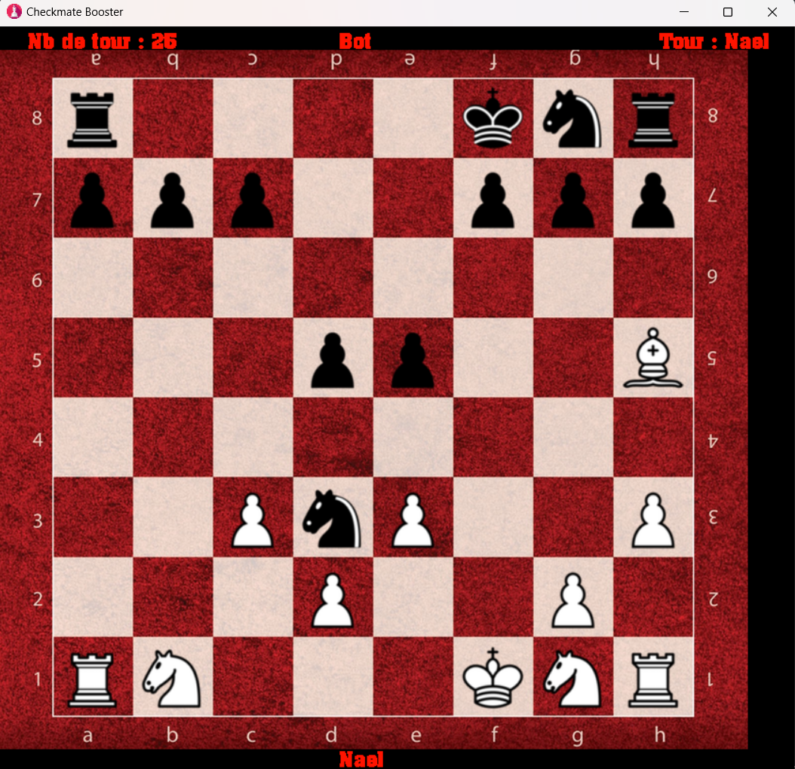
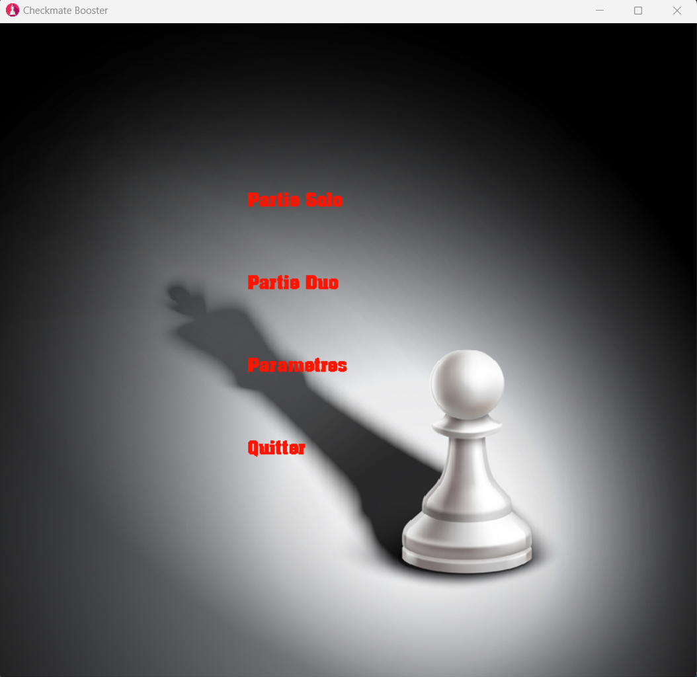

# Jeu d'échecs

## Présentation du jeu

Ce jeu d'échecs a été développé dans le cadre d'un projet universitaire en langage C++. Le but de ce projet était de mettre en pratique les concepts de la programmation orientée objet et les algorithmes de recherche.

Le jeu d'échecs est un jeu de stratégie pour deux joueurs. Le plateau de jeu est composé de 64 cases, alternativement claires et foncées, réparties sur un damier de 8 lignes et 8 colonnes. Chaque joueur dispose de 16 pièces (1 roi, 1 reine, 2 tours, 2 fous, 2 cavaliers et 8 pions) qui sont placées sur les cases de la première et deuxième rangée de son côté du plateau. Le but du jeu est de mettre le roi de l'adversaire en échec et mat.

## Explication des règles

Les règles du jeu d'échecs sont relativement simples. Chaque joueur déplace une pièce à son tour sur le plateau de jeu. Les pièces se déplacent selon des mouvements spécifiques. Par exemple, le cavalier se déplace en "L", la tour se déplace en ligne droite, etc.

Le but du jeu est de mettre le roi de l'adversaire en échec et mat. Lorsqu'un roi est en échec, cela signifie qu'il est menacé d'être capturé par une pièce adverse. Si le joueur ne peut pas protéger son roi en déplaçant une autre pièce ou en capturant la pièce menaçante, le roi est en échec et mat et le joueur perd la partie.

## Fonctionnement

Le jeu d'échecs développé dans ce projet permet de jouer en solo contre une IA qui utilise l'algorithme Min-Max pour prendre des décisions de jeu. Il est également possible de jouer en duo grâce à un menu interactif.

L'IA utilise une recherche en profondeur pour explorer les différents coups possibles et déterminer la meilleure option. Elle peut également évaluer la qualité de la position actuelle du jeu pour déterminer les coups à jouer.

Le menu permet aux joueurs de saisir leurs coups à tour de rôle. Le jeu vérifie ensuite si le coup est valide avant de le jouer. Si le coup est invalide, le joueur doit le saisir à nouveau. 

![Image du menu du jeu d'échecs en C++]